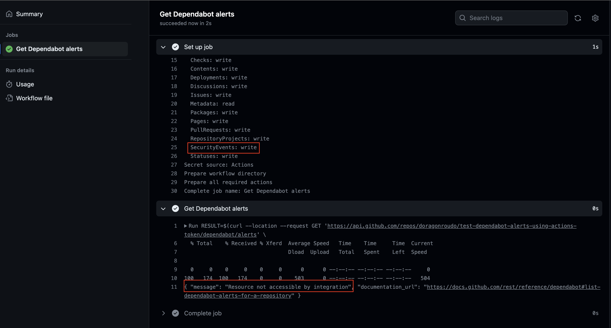

# Test get dependabot alerts using GitHub Actions's built-in installation token

When using `github.token` context as an authorization token to call [List Dependabot alerts for a repository](https://docs.github.com/en/rest/dependabot/alerts?apiVersion=2022-11-28#list-dependabot-alerts-for-a-repository) API, it returns error: `Resource not accessible by integration`. Even with [Permissions for the GITHUB_TOKEN](https://docs.github.com/en/actions/security-guides/automatic-token-authentication#permissions-for-the-github_token) `security-events` set to `write`.

Refer to [this workflow run](https://github.com/doragonroudo/test-dependabot-alerts-using-actions-token/actions/runs/4815533319/jobs/8574309264)

Screenshot:

